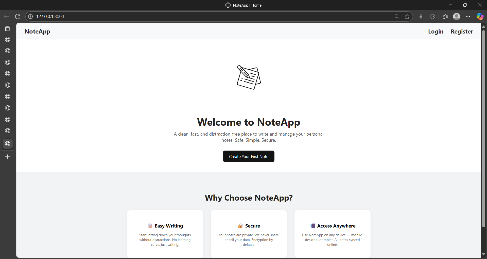

# NoteApp - A Simple Note-Taking Django App

Welcome to **NoteApp**, a secure note management application built with Django and Django REST Framework. Users can register, authenticate using JWT tokens, and manage their personal notes through both a responsive web interface and RESTful APIs. The application provides user-specific note access, search functionality, pagination, and full CRUD operations while ensuring data privacy and security.

---

### Features

- User Registration & Login with validation
- JWT Authentication using Django REST Framework
- Create, Edit, and Delete notes
- REST API for Notes Management
- Each user has their own notes (private)
- Search and Pagination support in API
- Light/Dark mode toggle (with localStorage)
- Responsive HTML + CSS frontend
- Form error messages and success notifications
- Custom 404 error page

---

### Tech Stack

- **Backend**: Django 6.0.6 (Python)
- Django REST Framework (DRF)
- Simple JWT Authentication
- **Frontend**: HTML, CSS (with static files)
- **Database**: SQLite (default)

---
## 📸 Screenshot

